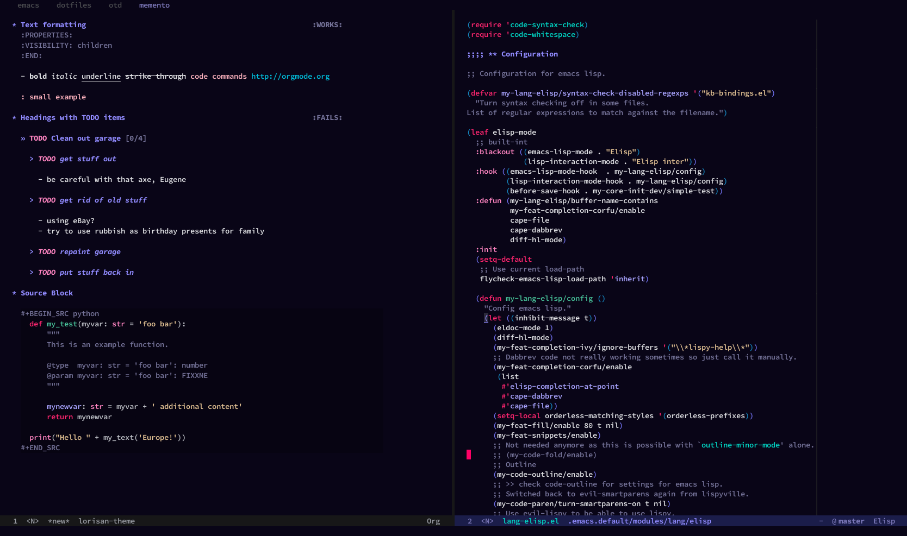

# Lorisan Emacs Dark Theme #

Dark color theme for Emacs >= 24

## Installation

Theme is not available on melpa.

Install with straight and leaf for instance:

```emacs-lisp
(leaf lorisan-theme
  :straight (lorisan-theme :type git :host github :repo "hubisan/lorisan-theme")
  :url "https://github.com/hubisan/lorisan-theme"
  :doc "Dark theme for Emacs.")
```

## Screenshot



## Font Used in Screenshot

 Source Code Pro, medium.
